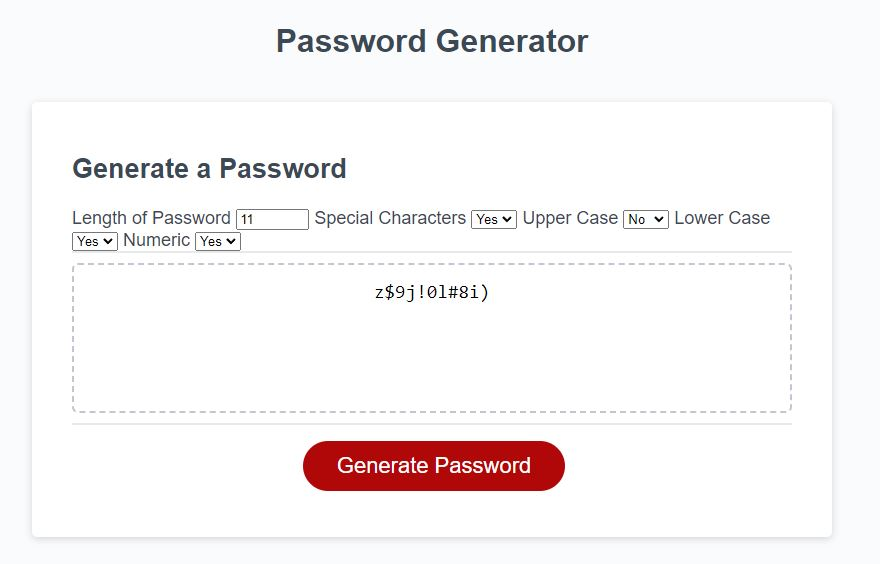

# Module3-Challenge
## Homework Assignment 3 - Password Generator 12/12/2022

### Motivation
This was the third assignment for our coding bootcamp. The assignment was to refactor existing code that was styled correctly but did not have the correct functionalties the user story required. The goal was to have the website work as intended by the acceptance criteria and ultimately generate a password based on passwored criteria set by the user all while following the rules of HTML, CSS, JavaScript.

### Build Status
Running as a GitHub Webpage

### Features
A basic webpage with drop down selectors that generates a new password with varying requirements.

### Installation
N/A

### Project Preview

### How to Use
The webpage can be found on the following this link [here.](https://aguilarj5.github.io/Module3-Challenge/)

### Credits
Coding Bootcamp

### License
N/A

